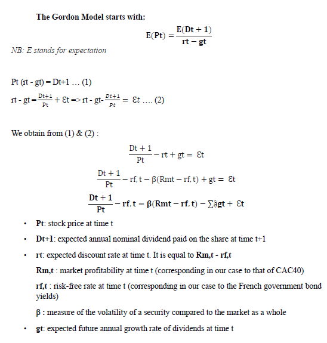

# DividendModel
The work of authors Foerster and Sapp in their 2005 article the Dividend Discount Model in Long-Run: A clinical study highlights and applies the Dividend Discount model, the Gordon Growth model and the Fed model. Our study summarises the work of the authors linked to the Dividend Discount Model but applied to a different company and over a different period: AIR LIQUIDE

### The Gordon Model

### To run the project
* Create a environment from the requirements.txt file (Conda environment + Windows-based only)
* Run the notebook *dividend-model*

### Closing
Feel free to comment and add any constructive critics that could help me better my solution :) 